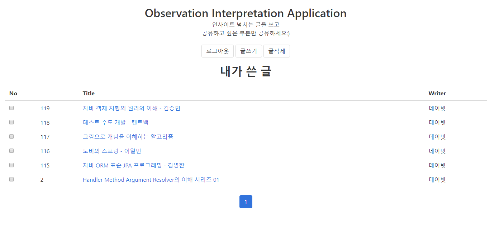

# oia-text-sharing

## 소개
하나의 글을 여러 블록으로 나누어 기록하여 원하는 블록만 공유할 수 있는 서비스입니다

## 개발환경
* language : java 8
* back-end framework : spring boot 2.1.7
* database : H2 (in-memory database)
* template engine : handlebars for java
* front-end css framework : bulma

## 도메인
* Article 구조
  * Article은 하나의 글에 대응되는 객체입니다
  * 하나의 Article은 n개의 MainBlock을 가질 수 있는 객체입니다
  * 하나의 MainBlock은 n개의 SubBlock을 가질 수 있는 객체입니다
  * 실제 글이 작성되는 곳은 SubBlock입니다
  * 

* 공유 링크 생성
  * 

  * 공유하기 원하는 Article의 요청 주소(/articles/id)와 Secret Key(암호화에 사용될 salt값)을 조합하여 암호화된 문자열을 생성합니다. 동일한 입력값에 대해 동일한 암호화된 문자열을 생성하며 생성된 문자열은 공유 링크의 key값으로 사용됩니다.
  * 공유링크 예시
    * id값이 2인 article의 공유 url
    * /articles/2/share?key=[암호화된 문자열]

* API 요청
  * 
  * 최초 로그인시 얻은 JWT(토큰)을 통해 사용자 인증을 거쳐 API를 요청할 수 있습니다

## 화면
* 로그인 후 메인
  * 
* 글쓰기(좌측) & 공유 페이지(우측)
  * 
* 메인
  * 
* 로그인
  * 